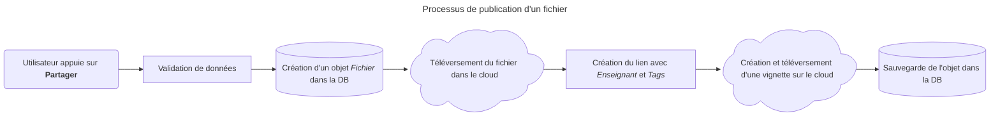
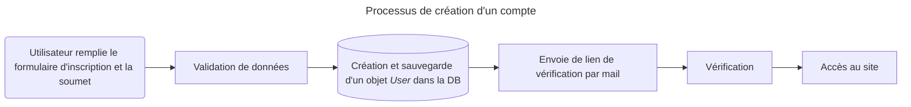

# La Caverne d'AliBaba  <!-- omit from toc -->
**Alieldeen Ibrahim**  
Groupe 402

Travail de Maturité  
Maître accompagnant : **M. Mathieu Schiess**

*COLLÈGE SISMONDI*

___

- [Le *Tech Stack*](#le-tech-stack)
  - [*Backend*](#backend)
  - [*Frontend*](#frontend)
  - [*Database* (base de données)](#database-base-de-données)
  - [*Cloud storage*](#cloud-storage)
- [Les *MVPs*](#les-mvps)
- [Publication des fichiers](#publication-des-fichiers)
  - [Comment Django interagit-il avec la DB ?](#comment-django-interagit-il-avec-la-db-)
  - [Organisation des données](#organisation-des-données)
  - [Dans les coulisses](#dans-les-coulisses)
  - [Problèmes rencontrés](#problèmes-rencontrés)
- [Authentification utilisateur](#authentification-utilisateur)
  - [Inscription au site / Création d'un compte](#inscription-au-site--création-dun-compte)
  - [Vérification par mail](#vérification-par-mail)
  - [Connexion et session](#connexion-et-session)
- [Accès et téléchargements des fichiers](#accès-et-téléchargements-des-fichiers)

---

<br>

À travers son parcours académique, on fait tous.tes face aux évaluations, c'est malheureusement inevitable. Il arrive parfois que, au moment de la révision pour une des ces fameuses évaluations, les fiches de théorie données pour son/sa prof n'aident pas vraiment, ou on n'a plus d'exercices pour s'entrainer parce que celui/celle n'en fait tout simplement très peu. Il est bien évidement possible de chercher sur l'internet, mais c'est très difficile de trouver des exercices avec la même difficulté que celle qu'on fait en cours, ou de trouver le sujet expliqué de la même manière que son adorable prof. Il est aussi possible de demander à ses amis, mais quel.le ami.e ? Celle qui vient presque jamais en cours ? Celui qui ne note quasiment rien ? C'est pourquoi j'ai décidé de faire un site web qui permet de partager tous ses fichiers afin de faciliter le recherche ceux-ci dans les moments les plus (ou les moins) urgents.

## Le *Tech Stack*

La definition du *Tech Stack* sur GeeksForGeek[^tech-stack] : 
> A tech stack (technology stack) is the collection of tools, frameworks, programming languages, and platforms used to build and run a web or mobile application. It represents the layered foundation of modern software where each component works together to enable functionality, performance, and scalability.  

[^tech-stack]: GEEKSFORGEEKS, 2025. What are Tech Stacks? Choosing the Right One. GeeksforGeeks [en ligne]. 10 novembre 2025. Disponible à l'adresse : https://www.geeksforgeeks.org/blogs/what-are-tech-stacks-choosing-the-right-one/

Le *Tech stack* se divise en 4 parties principales:

- ***Frontend*** : Les technologies définissant ce que le client voit et interagit avec. Elle est aussi appelée *Client-side*.
- ***Backend*** : Les technologies responsables pour la logique de l'application, le traitement et la gestion des données. C'est ce qui se passe "en coulisse". Elle est aussi appelée *Server-side*.
- ***Database*** **(base de données)** : C'est ici qu'on stocke et gère les données.
- **Infrastructure** : Il s'agit de la mise en production (*deployment*), le *cloud*, etc.

Il existe une quantité énorme de *stacks* dont les plus populaires utilisent JavaScript comme langage principale (e.g. MERN, MEAN, MEVN, etc.). Il y aussi d'autres basés sur d'autres langages comme *Ruby on rails* pour Ruby, *Spring* pour Java, *.NET* pour C#, *Django* et *Flask* pour Python, et plein d'autres.  
Je vous présente donc le stack pour lequel j'ai opté.

### *Backend*

Le langage que je connais le mieux est Python, donc mon choix de *framework* était entre *Django* et *Flask*. Comme tout, chacun a ses propres avantages et désavantages.  

Commençons par Django. Django, publiée en 2005, est une *framework* qu'on dit est *batteries included*, c'est-à-dire qu'elle te donne tout ce dont on a besoin *out of the box*. Elle est magnifique pour des grands applications, mais *overkill* pour des petits projets ou des microservices. Elle est très bien documentée[^django] avec une grande communauté. Il existe une quantité énorme de tutos en ligne pour presque tout les choses qu'on aimerait faire. Il est important de savoir que Django est utilisé ou a été utilisé par pleins d'applications notamment Instagram, Spotify, YouTube, Pinterest, Mozilla et autres.

Inversement, Flask est très minimale, on ne te donne rien au début. Ceci peut être bon et mauvais selon les cas. Bon car elle permet une grande flexibilité, ce qui est très bien pour commencer très rapidement un projet assez petit, mauvais quand le projet est assez grand. Ainsi, elle nécessite soit l'installation de beaucoup de modules pour faire la même chose que Django soit la création soi-même de ses modules. Voici une liste non exhaustive des modules à installer si je travaillais avec Flask :  

Fonctionnalité | Module
---------------|----------
 ORM | SQLAlchemy et Flask-SQLAlchemy
 Authentification | Flask-login
 Validation et Création des forms | WTForms et Flask-WTF
 Interface d'admin | Flask-admin
 ...

De plus, ces modules ne sont pas toujours bien documentés, cependant, Flask elle-même est aussi bien documentée[^flask] avec une communauté un peu moins large que celle de Django. Flask est utilisé plutôt par des entreprises pour faire des microservices, ce qui est le cas pour Netflix, Pinterest, Airbnb.

J'ai donc choisi de faire ce projet avec Django pour les raisons listées ci-dessus.

[^django]: Voici sa documentation : [https://docs.djangoproject.com/](https://docs.djangoproject.com/)
[^flask]: Voici sa documentation : [https://flask.palletsprojects.com/](https://flask.palletsprojects.com/)

### *Frontend*

J'ai choisi de ne pas utiliser une *frontend framework*, car je trouve que l'application n'a pas besoin de la complexité qu'amène une comme *React* or *Vue*. À savoir que pour utiliser une *frontend*, on devrait écrire un API qui sert les informations à cette dernière (CSR, dit *Client-side rendering*) au lieu d'utiliser les *templates* de Django pour générer l'HTML côté serveur (SSR, dit *Server-side rendering*), ce qui, à mon avis, rend les choses plus compliquées. Cependant, il faut quand même du dynamisme dans le site, je vais donc utiliser Vanilla JS (ou HTMX). (HTMX est un entre-deux. Elle m'évite d'écrire beaucoup de *boilerplate*. Si j'écrivais tout en Vanilla JS, je serais essentiellement en train d'écrire mon propre *Framework*). J'ai choisi d'utiliser *Bootstrap* au lieu d'écrire moi-même le CSS car elle permet de faire le *design* qu'on veut en très peu de temps.


### *Database* (base de données)

PostgreSQL pour Trigram Search

### *Cloud storage*

AWS S3 buckets

## Les *MVPs*

Après avoir choisi notre *stack*, il faut diviser le projet en *MVPs* (*Minimum Viable Product* en pluriel). Un *MVP* est la version la plus minimale d'un produit ou d'une fonctionnalité. Il s'agit d'implémenter seulement ce qui est nécessaire pour que l'application fonctionne bien et ensuite commencer à l'améliorer. Le but est donc de concevoir le produit le plus rapidement possible afin de pouvoir le montrer au monde et ensuite avoir des retours. En bref, il s'agit d'une version provisoire, mais qui fonctionne bien.[^mvp]

[^mvp]: WIKIMEDIA. Minimum viable product. Wikipédia (en ligne). Disponible à l'adresse : [https://en.wikipedia.org/wiki/Minimum_viable_product](https://en.wikipedia.org/wiki/Minimum_viable_product)

Pour ce projet, les *MVPs* sont :
- Publication des fichiers
- Authentification utilisateur : Créer un compte, se connecter, se déconnecter, etc.
- Accès aux fichiers, ainsi que leurs téléchargements

## Publication des fichiers
La publication des fichiers est la fonctionnalité qui donne à l'utilisateur la possibilité de partager ses documents avec le monde. L'une des difficultés dans l'implémentation de cette fonctionnalité est de savoir et de décider les informations qu'un utilisateur doit entrer avec le téléversement du fichier. Les informations données par l'utilisateur sont principalement la matière, le type de fichier (évaluation, exercices, théorie, etc.), le degré pour lequel le fichier est destiné, ainsi que l'enseignant qui a donné ce fichier. Elles doivent être stockées dans la DB[^db] de manière structurée afin de pouvoir s'en servir plus tard dans le *MVP* **[Accès et téléchargements des fichiers](#accès-et-téléchargements-des-fichiers)**.

[^db]: Pour des raisons de brièveté et de légèreté de lecture, DB signifie base de données.

### Comment Django interagit-il avec la DB ?
Django utilise la technique d'*ORM* (*Object-relational mapping*) pour gérer les données. Dans cette technique, on associe les tableaux d'une DB à des classes, donc chaque colonne du tableau est représentée par une propriété de la classe et chaque ligne du tableau est représentée par une instance de la classe, d'où "*mapping*" dans *Object-relational mapping*. Cette technique ne fonctionne bien sûr qu'avec les langages de programmation orientée objet, ce qui est le cas de Python. Le tableau d'une DB est appelé un modèle (*model* en anglais) dans le monde de Django. La technique d'*ORM* permet au développeur de pouvoir se concentrer sur seulement une langage lors du conception de son projet au lieu de devoir s'occuper d'une autre, SQL, lui donnant une vitesse de production. De plus, les *ORMs* (*Object-relational mapper*)[^orm-orm] améliorent la sécurité en réduisant fortement le risque des attaques du type *SQL injection*[^SQLi], et ne pas faire un *Bobby Tables*[^bobby-tables]. Cependant, les requêtes générées avec un *ORM* peuvent être moins optimisées que celles en *Raw SQL*.

[^orm-orm]: Il est important de différencier *Object-relational mapping*, c'est-à-dire la technique, et *Object-relational mapper*, c'est-à-dire l'outil qui nous fait utiliser la technique.

[^SQLi]: Une attaque *SQL injection* se fait quand un malfaisant tape du SQL dans un champ de saisie, et ensuite ce SQL est mis dans la requête SQL du programme à l'aide de concatenation, ce qui fait une requête qui va leur donner accès aux données dans la base. Vous pouvez vous informer plus ici : [https://www.w3schools.com/SQl/sql_injection.asp](https://www.w3schools.com/SQl/sql_injection.asp)

[^bobby-tables]: En 2007, xkcd a publié une comique avec un personnage dont le prénom a effectué une attaque *SQL injection*. [https://xkcd.com/327/](https://xkcd.com/327/)

### Organisation des données
Voici un diagramme[^diagram] des différents modèles dans l'application et leur relation:

```mermaid
---
title: Schema de la DB
config:
  theme: redux-color
  look: neo
---
erDiagram
    direction LR
    USER {
        int id PK
        autre propriétés...
    }

FICHIER {
        uuid id PK
        int user_id FK
        int enseignant_id FK
        string name
        string file
        string thumbnail "vignette"
        int year "degré"
        string subject
        string type "évaluation, exercices, etc."
        string ecole
        boolean annotated
        text description
        int status "accepté, en attente, rejetée"
        datetime uploadDatetime
    }

    ENSEIGNANT {
        int id PK
        string name
        string ecole
    }

    TAG {
        int id PK
        string name
    }

    USER ||--o{ FICHIER : publie
    ENSEIGNANT ||--o{ FICHIER : concerne
    FICHIER }o--o{ TAG : possède
```
<br/>

[^diagram]: Le markdown écrit pour concevoir ce diagramme a été crée à l'aide de ChatGPT le 13 septembre 2026. Le fichier contenant les modèles lui a été donné afin qu'il me donne le markdown nécessaire. J'ai ensuite modifié selon mes besoins le diagramme.

On peut voir dans ce diagramme toutes les relations entre modèles dans la DB. Un *user* publie des fichiers, en mentionnant l'enseignant concerné. La relation entre `User` et `Fichier`, et celle entre `Enseignant` et `Fichier` s'appelle une relation *one-to-many* (un-à-plusieurs); un utilisateur peut avoir plusieurs fichiers, mais un fichier n'appartient qu'à un utilisateur. On associe à chaque fichier un ou plusieurs *tag* (mot clé), qui aident plus tard à la recherche de ces documents. Cette relation s'appelle *Many-to-many*; un *tag* peut être associé à plusieurs fichiers et un fichier peut avoir plusieurs *tags*. Il est important de savoir que pour avoir une relation *many-to-many* (plusieurs-à-plusieurs), il y a besoin d'un tableau de plus qui n'as pas de modèle associé, il sert juste de pont entre les deux. Ce tableau est créé par défaut par l'*ORM* de Django, mais on peut aussi créer le sien.
Pour les écoles, matières, types de fichier et années, je n'ai pas créé de modèle. J'ai utilisé des *enums*[^enum], car ces valeurs sont toujours constantes, ne changeront jamais, et il n'y en a pas beaucoup. Pour les enseignants, j'ai dû en faire un modèle car je n'ai pas accès à une liste de tous les enseignants de tous les collèges de Genève. À chaque publication d'un fichier, un enseignant ne figurant pas déjà dans la DB est ajouté.

[^enum]: "En programmation informatique, un type énuméré (appelé souvent énumération ou juste enum, parfois type énumératif ou liste énumérative) est un type de données qui consiste en un ensemble de valeurs constantes. Ces différentes valeurs représentent différents cas ; on les nomme énumérateurs. Lorsqu'une variable est de type énuméré, elle peut avoir comme valeur n'importe quel cas de ce type énuméré." [WIKIMEDIA. Type énuméré. Wikipédia (en ligne). Disponible à l'adresse : [https://fr.wikipedia.org/wiki/Type_%C3%A9num%C3%A9r%C3%A9](https://fr.wikipedia.org/wiki/Type_%C3%A9num%C3%A9r%C3%A9)]

### Dans les coulisses

<br/>

Le processus de publication d'un fichier est très simple grâce à Django. Quand un utilisateur partage un fichier, la validation des données, c'est-à-dire qu'elles soient bien remplies et du bon type, est effectuée par Django qui regarde les critères qui ont été déclarées lors de la création du modèle. De plus, la création d'un objet `Fichier` ainsi que son lien avec la DB est créé par l'*ORM* de Django.

Tous les fichiers (et vignettes) sont stockés sur un bucket AWS S3. Stocker les documents sur un tel service permet une séparation de tâches où le serveur s'occupe seulement du programme et de la conservation des métadonnées des fichiers dans la DB et le service s'occupe de la conservation des fichiers. Cette organisation allège le travail du serveur, car leur téléchargement ne nécessite pas un transit à travers le serveur. Plus encore, en cas d'augmentations du nombre de serveurs hébergeant l'application, ils pourront tous communiquer au service au lieu de chercher dans chacun où se trouve un certain fichier.

### Problèmes rencontrés
Thumbnail, tags, accès au fichier avec S3

## Authentification utilisateur
L'authentification utilisateur est très important pour l'application car elle permet de vérifier si l'utilisateur est bien un étudiant du Collège de Genève et lui autorisé l'accès. Ainsi, l'utilisateur doit pouvoir créer son propre compte, vérifier son adresse mail, se connecter afin de s'authentifier et pouvoir acceder à la caverne.

Un des avantages de Django dont j'ai parlé dans la section [Le *Tech Stack*](#le-tech-stack) est son système d'authentification. Django possède déjà un modèle `AbstractUser` qui contient toutes les propriétés nécessaires pour sauvegarder un utilisateur, tel que l'identifiant et le mot de passe, et auquel j'ai ajouté une propriété `ecole`.

### Inscription au site / Création d'un compte

<br/>

De même que pour le processus de publication d'un fichier, le processus de création d'un compte bénéficie du système de formulaire de Django. Ainsi, la validation des données, qui consiste à vérifier l'unicité de l'identifiant et la sécurité de mot de passe, est effectué par Django ainsi que la création du compte et sa sauvegarde dans la DB. Il est important de savoir que Django ne stockent pas les mots de passes en tant que tel, mais les stocke hachés, pour garantir leur sécurité au sein de la DB.

### Vérification par mail
La vérification sert principalement à s'assurer que la personne qui est en train de créer le compte est bien la personne qu'elle prétend être et éviter toute tentative de fraude ou d'usurpation d'identité. De plus, dans le cadre de l'application, elle sert à vérifier que la personne possède bien un compte eduge, car le programme envoie le mail de vérification à `<identifiant eduge entré>@eduge.ch`. Il existe donc 3 possibilités:
1. la personne s'est inscrite avec un identifiant eduge invalide. Elle ne recevra jamais le mail et ainsi n'aura jamais accès au site.
2. la personne s'est inscrite avec un identifiant eduge valide mais qui n'appartient pas à elle. Elle n'a normalement[^verify-2] pas accès au mail, donc elle n'aura pas accès au site.
3. la personne s'est inscrite avec un identifiant eduge valide appartenant à elle. Elle pourra donc cliquer sur le lien de vérification envoyé et ensuite accéder au site.

[^verify-2]: Je dis "normalement" car elle peut avoir accès à cause d'une cyberattaque, mais ceci ne nous concerne pas.

Le lien de vérification est valide pendant 24h avec la possibilité d'en générer un autre afin de quand-même donner un chance en cas d'oubli. Ce qui assure l'unicité du lien, c'est que son *token* dépend d'une certaine information de l'utilisateur,le temps et la clé secrète de l'application[^secret-key], etc.

[^secret-key]: "La clé secrète d’une installation Django. Elle est utilisée dans le contexte de la signature cryptographique, et doit être définie à une valeur unique et non prédictible." [DJANGO SOFTWARE FOUNDATION, 2026. Réglages. Django (Version 6.1) (en ligne). Disponible à l'adresse : [https://docs.djangoproject.com/fr/6.1/ref/settings/#std-setting-SECRET_KEY](https://docs.djangoproject.com/fr/6.1/ref/settings/#std-setting-SECRET_KEY)]

### Connexion et session
La connexion et session sont gérées par Django sans grande modification ou ajout de ma part. Une session, qui est créée suite à la connexion d'un utilisateur, me permet de pouvoir lier l'utilisateur qui a publié un fichier au fichier publié.****


## Accès et téléchargements des fichiers
tag search, then filtering