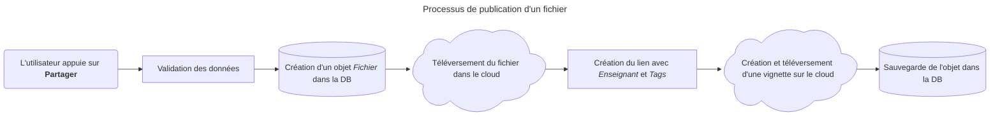
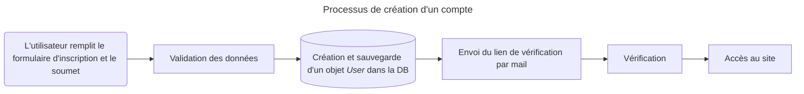
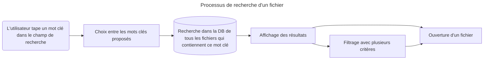

# La Caverne d'AliBaba  <!-- omit from toc -->
**Alieldeen Ibrahim**  
Groupe 402

Travail de Maturité  
Maître accompagnant : **M. Mathieu Schiess**

*COLLÈGE SISMONDI*

___

- [Le *Tech Stack*](#le-tech-stack)
  - [*Backend*](#backend)
  - [*Frontend*](#frontend)
  - [*Database* (base de données)](#database-base-de-données)
- [Les *MVPs*](#les-mvps)
- [Publication des fichiers](#publication-des-fichiers)
  - [Comment Django interagit-il avec la DB ?](#comment-django-interagit-il-avec-la-db-)
  - [Organisation des données](#organisation-des-données)
  - [Dans les coulisses](#dans-les-coulisses)
- [Authentification utilisateur](#authentification-utilisateur)
  - [Inscription au site / Création d'un compte](#inscription-au-site--création-dun-compte)
  - [Vérification par mail](#vérification-par-mail)
  - [Connexion et session](#connexion-et-session)
- [Accès et téléchargement des fichiers](#accès-et-téléchargement-des-fichiers)
  - [Recherche d'un fichier](#recherche-dun-fichier)
  - [*Auto-suggestion* (suggestion semi-automatique)](#auto-suggestion-suggestion-semi-automatique)
  - [Filtrage et affichage des résultats](#filtrage-et-affichage-des-résultats)
  - [Affichage et téléchargement des fichiers](#affichage-et-téléchargement-des-fichiers)
- [La suite](#la-suite)

---

<br>

À travers son parcours académique, on fait toutes et tous face aux évaluations, c'est malheureusement inévitable. Il arrive parfois qu'au moment de la révision pour une de ces fameuses évaluations, les fiches de théorie données par son/sa prof n'aident pas vraiment, ou qu'on n'ait plus d'exercices pour s'entraîner parce qu'il/elle n'en fait tout simplement que très peu. Il est bien évidemment possible de chercher sur Internet, mais c'est très difficile de trouver des exercices de la même difficulté que ceux qu'on fait en cours, ou de trouver le sujet expliqué de la même manière que son adorable prof. Il est aussi possible de demander à ses amis, mais quel.le ami.e ? Celle qui ne vient presque jamais en cours ? Celui qui ne note quasiment rien ? C'est pourquoi j'ai décidé de faire un site web qui permet de partager tous ses fichiers afin de faciliter la recherche de ceux-ci dans les moments les plus (ou les moins) urgents.

## Le *Tech Stack*
La définition du *Tech Stack* sur GeeksforGeeks[^tech-stack] : 
> A tech stack (technology stack) is the collection of tools, frameworks, programming languages, and platforms used to build and run a web or mobile application. It represents the layered foundation of modern software where each component works together to enable functionality, performance, and scalability.  

[^tech-stack]: GEEKSFORGEEKS, 2025. What are Tech Stacks? Choosing the Right One. GeeksforGeeks [en ligne]. 10 novembre 2025. Disponible à l'adresse : https://www.geeksforgeeks.org/blogs/what-are-tech-stacks-choosing-the-right-one/

Le *Tech stack* se divise en 4 parties principales :

- ***Frontend*** : Les technologies définissant ce que le client voit et ce avec quoi il interagit. Cette partie est aussi appelée *Client-side*.
- ***Backend*** : Les technologies responsables de la logique de l'application, du traitement et de la gestion des données. C'est ce qui se passe "en coulisse". Cette partie est aussi appelée *Server-side*.
- ***Database*** **(base de données)** : C'est ici qu'on stocke et gère les données.
- **Infrastructure** : Il s'agit de la mise en production (*deployment*), du *cloud*, etc.

Il existe une quantité énorme de *stacks* dont les plus populaires utilisent JavaScript comme langage principal (e.g. MERN, MEAN, MEVN, etc.). Il y en a aussi d'autres basés sur d'autres langages comme *Ruby on Rails* pour Ruby, *Spring* pour Java, *.NET* pour C#, *Django* et *Flask* pour Python, et plein d'autres.
Je vous présente donc le stack pour lequel j'ai opté.

### *Backend*
Le langage que je connais le mieux est Python, donc mon choix de *framework* était entre *Django* et *Flask*. Comme tout, chacun a ses propres avantages et désavantages.

Commençons par Django. Django est un *framework* qu'on dit "*batteries included*", c'est-à-dire qu'il donne tout ce dont on a besoin *out of the box*. Il est magnifique pour de grandes applications, mais *overkill* pour de petits projets ou des microservices. Il est très bien documenté[^django] avec une grande communauté. Il existe une quantité énorme de tutos en ligne pour presque toutes les choses qu'on aimerait faire.

Inversement, Flask est très minimal, on ne te donne rien au début. Ceci peut être bon et mauvais selon les cas. Bon car il permet une grande flexibilité, ce qui est très bien pour commencer très rapidement un projet assez petit, mauvais quand le projet est assez grand. Ainsi, il nécessite soit l'installation de beaucoup de modules pour faire la même chose que Django, soit la création soi-même de ces modules. Voici une liste non exhaustive des modules à installer si je travaillais avec Flask :  

Fonctionnalité | Module
---------------|----------
 ORM | SQLAlchemy et Flask-SQLAlchemy
 Authentification | Flask-login
 Validation et Création des forms | WTForms et Flask-WTF
 Interface d'admin | Flask-admin
 ...

De plus, ces modules ne sont pas toujours bien documentés. Cependant, Flask lui-même est bien documenté[^flask] avec une communauté un peu moins large que celle de Django.

J'ai donc choisi de faire ce projet avec Django pour les raisons listées ci-dessus.

[^django]: Voici sa documentation : [https://docs.djangoproject.com/](https://docs.djangoproject.com/)
[^flask]: Voici sa documentation : [https://flask.palletsprojects.com/](https://flask.palletsprojects.com/)

### *Frontend*
J'ai choisi de ne pas utiliser de *frontend framework*, car je trouve que l'application n'a pas besoin de la complexité qu'amène un framework comme *React* ou *Vue*. Cependant, il faut quand même du dynamisme dans le site, je vais donc utiliser Vanilla JS et htmx (dont je parle dans la sous-section [*Auto-suggestion* (suggestion semi-automatique)](#auto-suggestion-suggestion-semi-automatique)).

J'ai choisi d'utiliser *Bootstrap* de manière générale et CSS pour les petites modifications car *Bootstrap* permet de faire le *design* qu'on veut en très peu de temps.[^bootstrap-tailwind]

[^bootstrap-tailwind]: Cette sous-section est écrite le 17 septembre 2026. J'ai découvert que *Bootstrap* est assez limité et ne possède pas tout ce dont j'ai besoin, donc je finis quand même par écrire plus de CSS que voulu. Il est très probable que je cesserai d'utiliser *Bootstrap* et commencerai à utiliser *Tailwind*. Plus d'informations seront mises suite au changement.


### *Database* (base de données)
J'ai choisi d'utiliser PostgreSQL à cause de certaines fonctionnalités qui ne sont possibles qu'avec elle. J'explique mon choix plus en profondeur dans la sous-section [*Auto-suggestion* (suggestion semi-automatique)](#auto-suggestion-suggestion-semi-automatique).

## Les *MVPs*
Après avoir choisi notre *stack*, il faut diviser le projet en *MVPs* (*Minimum Viable Product* au pluriel). Un *MVP* est la version la plus minimale d'un produit ou d'une fonctionnalité. Il s'agit d'implémenter seulement ce qui est nécessaire pour que l'application fonctionne bien et ensuite de commencer à l'améliorer. Le but est donc de concevoir le produit le plus rapidement possible afin de pouvoir le montrer au monde et ensuite d'avoir des retours. En bref, il s'agit d'une version provisoire, mais qui fonctionne bien.[^mvp]

[^mvp]: WIKIMEDIA. Minimum viable product. Wikipédia (en ligne). Disponible à l'adresse : [https://en.wikipedia.org/wiki/Minimum_viable_product](https://en.wikipedia.org/wiki/Minimum_viable_product)

Pour ce projet, les *MVPs* sont :
- Publication des fichiers
- Authentification utilisateur : Créer un compte, se connecter, se déconnecter, etc.
- Accès aux fichiers, ainsi que leur téléchargement

## Publication des fichiers
La publication des fichiers est la fonctionnalité qui donne à l'utilisateur la possibilité de partager ses documents avec le monde. L'une des difficultés dans l'implémentation de cette fonctionnalité est de savoir et de décider quelles informations un utilisateur doit entrer avec le téléversement du fichier. Ces informations doivent être stockées dans la DB[^db] de manière structurée afin de pouvoir s'en servir plus tard dans le *MVP* [Accès et téléchargements des fichiers](#accès-et-téléchargements-des-fichiers).

[^db]: Pour des raisons de brièveté et de légèreté de lecture, DB signifie base de données.

### Comment Django interagit-il avec la DB ?
Django utilise la technique d'*ORM* (*Object-relational mapping*) pour gérer les données. Dans cette technique, on associe les tables d'une DB à des classes, donc chaque colonne de la table est représentée par une propriété de la classe et chaque ligne de la table est représentée par une instance de la classe, d'où "*mapping*" dans *Object-relational mapping*. Cette technique ne fonctionne bien sûr qu'avec les langages de programmation orientée objet, ce qui est le cas de Python. La table d'une DB est appelée un modèle (*model* en anglais) dans le monde de Django. La technique d'*ORM* permet au développeur de pouvoir se concentrer sur seulement un langage lors de la conception de son projet au lieu de devoir s'occuper d'un autre, SQL, lui donnant une vitesse de production. De plus, les *ORMs* (*Object-relational mapper*)[^orm-orm] améliorent la sécurité en réduisant fortement le risque d'attaques du type *SQL injection*[^SQLi], et en évitant de faire un *Bobby Tables*[^bobby-tables]. Cependant, les requêtes générées avec un *ORM* peuvent être moins optimisées que celles en *Raw SQL*.

[^orm-orm]: Il est important de différencier *Object-relational mapping*, c'est-à-dire la technique, et *Object-relational mapper*, c'est-à-dire l'outil qui nous fait utiliser la technique.

[^SQLi]: Une attaque *SQL injection* se fait quand une personne malveillante tape du SQL dans un champ de saisie, et ensuite ce SQL est mis dans la requête SQL du programme à l'aide de la concaténation, ce qui fait une requête qui va lui donner accès aux données dans la base. Vous pouvez vous informer plus ici : [https://www.w3schools.com/SQl/sql_injection.asp](https://www.w3schools.com/SQl/sql_injection.asp)

[^bobby-tables]: En 2007, xkcd a publié un comic avec un personnage dont le prénom a effectué une attaque *SQL injection*. [https://xkcd.com/327/](https://xkcd.com/327/)

### Organisation des données
Voici un diagramme[^diagram] des différents modèles dans l'application et leurs relations :

```mermaid
---
title: Schéma de la DB
config:
  theme: redux-color
  look: neo
---
erDiagram
    direction LR
    USER {
        int id PK
        autres propriétés...
    }

FICHIER {
        uuid id PK
        int user_id FK
        int enseignant_id FK
        string name
        string file
        string thumbnail "vignette"
        int year "degré"
        string subject
        string type "évaluation, exercices, etc."
        string ecole
        boolean annotated
        text description
        int status "accepté, en attente, rejeté"
        datetime uploadDatetime
    }

    ENSEIGNANT {
        int id PK
        string name
        string ecole
    }

    TAG {
        int id PK
        string name
    }

    USER ||--o{ FICHIER : publie
    ENSEIGNANT ||--o{ FICHIER : concerne
    FICHIER }o--o{ TAG : possède
```
<br/>

[^diagram]: Le markdown écrit pour concevoir ce diagramme a été créé à l'aide de ChatGPT le 13 septembre 2026. Le fichier contenant les modèles lui a été donné afin qu'il me donne le markdown nécessaire. J'ai ensuite modifié selon mes besoins le diagramme.

On peut voir dans ce diagramme toutes les relations entre modèles dans la DB. Un *user* publie des fichiers, en mentionnant l'enseignant concerné. La relation entre `User` et `Fichier` et celle entre `Enseignant` et `Fichier` s'appellent des relations *one-to-many* (un-à-plusieurs) ; un utilisateur peut avoir plusieurs fichiers, mais un fichier n'appartient qu'à un utilisateur. On associe à chaque fichier un ou plusieurs *tags* (mots clés), qui aident plus tard à la recherche de ces documents. Cette relation s'appelle *Many-to-many* ; un *tag* peut être associé à plusieurs fichiers et un fichier peut avoir plusieurs *tags*. Il est important de savoir que pour avoir une relation *many-to-many* (plusieurs-à-plusieurs), il y a besoin d'une table de plus qui n'a pas de modèle associé, elle sert juste de pont entre les deux. Cette table est créée par défaut par l'*ORM* de Django, mais on peut aussi créer la sienne.
Pour les écoles, matières, types de fichier et années, je n'ai pas créé de modèle. J'ai utilisé des *enums*[^enum], car ces valeurs sont toujours constantes, ne changeront jamais, et il n'y en a pas beaucoup. Pour les enseignants, j'ai dû en faire un modèle car je n'ai pas accès à une liste de tous les enseignants de tous les collèges de Genève. À chaque publication d'un fichier, un enseignant ne figurant pas déjà dans la DB est ajouté.

[^enum]: "En programmation informatique, un type énuméré (appelé souvent énumération ou juste enum, parfois type énumératif ou liste énumérative) est un type de données qui consiste en un ensemble de valeurs constantes. Ces différentes valeurs représentent différents cas ; on les nomme énumérateurs. Lorsqu'une variable est de type énuméré, elle peut avoir comme valeur n'importe quel cas de ce type énuméré." [WIKIMEDIA. Type énuméré. Wikipédia (en ligne). Disponible à l'adresse : [https://fr.wikipedia.org/wiki/Type_%C3%A9num%C3%A9r%C3%A9](https://fr.wikipedia.org/wiki/Type_%C3%A9num%C3%A9r%C3%A9)]

### Dans les coulisses

<br/>

Le processus de publication d'un fichier est très simple grâce à Django. Quand un utilisateur partage un fichier, la validation des données, c'est-à-dire la vérification qu'elles sont bien remplies et du bon type, est effectuée par Django qui regarde les critères qui ont été déclarés lors de la création du modèle. De plus, la création d'un objet `Fichier` ainsi que son lien avec la DB sont assurés par l'*ORM* de Django.

Tous les fichiers (et vignettes) sont stockés sur un bucket AWS S3. Stocker les documents sur un tel service permet une séparation de tâches où le serveur s'occupe seulement du programme et de la conservation des métadonnées des fichiers dans la DB et le service s'occupe de la conservation des fichiers. Cette organisation allège le travail du serveur, car leur téléchargement ne nécessite pas de transit à travers le serveur. Plus encore, en cas d'augmentation du nombre de serveurs hébergeant l'application, ils pourront tous communiquer avec le service au lieu de chercher dans chacun où se trouve un certain fichier.

## Authentification utilisateur
L'authentification utilisateur est très importante pour l'application car elle permet de vérifier si l'utilisateur est bien un étudiant du Collège de Genève et de lui autoriser l'accès. Ainsi, l'utilisateur doit pouvoir créer son propre compte, vérifier son adresse mail, se connecter afin de s'authentifier et pouvoir accéder à la caverne.

Un des avantages de Django dont j'ai parlé dans la section [Le *Tech Stack*](#le-tech-stack) est son système d'authentification. Django possède déjà un modèle `AbstractUser` qui contient toutes les propriétés nécessaires pour sauvegarder un utilisateur, telles que l'identifiant et le mot de passe, et auquel j'ai ajouté une propriété `ecole`.

### Inscription au site / Création d'un compte

<br/>

De même que pour le processus de publication d'un fichier, le processus de création d'un compte bénéficie du système de formulaire de Django. Ainsi, la validation des données, qui consiste à vérifier l'unicité de l'identifiant et la sécurité du mot de passe, est effectuée par Django ainsi que la création du compte et sa sauvegarde dans la DB. Il est important de savoir que Django ne stocke pas les mots de passe en tant que tels, mais les stocke hachés, pour garantir leur sécurité au sein de la DB.

### Vérification par mail
La vérification sert principalement à s'assurer que la personne qui est en train de créer le compte est bien la personne qu'elle prétend être et à éviter toute tentative de fraude ou d'usurpation d'identité. De plus, dans le cadre de l'application, elle sert à vérifier que la personne possède bien un compte eduge, car le programme envoie le mail de vérification à `<identifiant eduge entré>@eduge.ch`. Il existe donc 3 possibilités :
1. la personne s'est inscrite avec un identifiant eduge invalide. Elle ne recevra jamais le mail et ainsi n'aura jamais accès au site.
2. la personne s'est inscrite avec un identifiant eduge valide mais qui ne lui appartient pas. Elle n'a normalement[^verify-2] pas accès au mail, donc elle n'aura pas accès au site.
3. la personne s'est inscrite avec un identifiant eduge valide lui appartenant. Elle pourra donc cliquer sur le lien de vérification envoyé et ensuite accéder au site.

[^verify-2]: Je dis "normalement" car elle peut y avoir accès à cause d'une cyberattaque, mais ceci ne nous concerne pas.

Le lien de vérification est valide pendant 24 h avec la possibilité d'en générer un autre afin de quand même donner une chance en cas d'oubli. Ce qui assure l'unicité du lien, c'est que son *token* dépend d'une certaine information de l'utilisateur, du temps et de la clé secrète de l'application[^secret-key], etc.

[^secret-key]: "La clé secrète d’une installation Django. Elle est utilisée dans le contexte de la signature cryptographique, et doit être définie à une valeur unique et non prédictible." [DJANGO SOFTWARE FOUNDATION, 2026. Réglages. Django (Version 6.1) (en ligne). Disponible à l'adresse : [https://docs.djangoproject.com/fr/6.1/ref/settings/#std-setting-SECRET_KEY](https://docs.djangoproject.com/fr/6.1/ref/settings/#std-setting-SECRET_KEY)]

### Connexion et session
La connexion et la session sont gérées par Django sans grande modification ou ajout de ma part. Une session, qui est créée suite à la connexion d'un utilisateur, me permet de pouvoir lier l'utilisateur qui a publié un fichier au fichier publié.


## Accès et téléchargement des fichiers
Suite à la publication des fichiers, il est important que l'utilisateur puisse y accéder et les télécharger ; c'est l'objectif de l'application. Cependant, avec l'augmentation du nombre de fichiers (ce qui, je l’espère, va arriver) sur l'application, il devient presque impossible de trouver ce que l'on veut. Afin de résoudre ce problème, il faut mettre un système de recherche efficace qui permettra à l'utilisateur de trouver ce dont il a besoin sans problème. C'est ici qu'on se sert de l'organisation des données dans la DB (cf. [Publication des fichiers](#publication-des-fichiers)).


### Recherche d'un fichier

<br/>

Quand l'utilisateur ouvre le site, en s'étant déjà connecté, il trouve directement la barre de recherche devant lui, ce qui lui facilite la tâche, car il n'a pas à la chercher ailleurs. Pour chercher ce dont il a besoin, l'utilisateur écrit des mots clés, les mêmes qui ont été inscrits lors de la publication.[^search]

[^search]: Cette section est écrite le 17 septembre 2026. Le système de recherche actuel est susceptible de changement. Les raisons seront écrites suite au changement.

### *Auto-suggestion* (suggestion semi-automatique)
L'*auto-suggestion* est une fonctionnalité qui "prédit" et montre à l'utilisateur des fins possibles à ce qu'il est en train d'écrire lors de sa recherche. Elle lui permet de gagner en rapidité et rend sa requête plus précise. Dans l'application, cette fonctionnalité est possible grâce à PostgreSQL. Dans PostgreSQL, il est possible de faire une recherche par *Trigram similarity*[^trigram] à l'aide du module `pg_trgm`, ce qui rend la tâche très fluide. Étant donné que la langue française fait usage des accents, il est important que les résultats ne dépendent pas de leur présence, car les accents ne sont pas toujours mis lors de la recherche. Pour ce faire, il existe un autre module `unaccent` dont la seule fonction est d'enlever les accents. Ces 2 modules sont propres à PostgreSQL.

[^trigram]: "A trigram is a group of three consecutive characters taken from a string. We can measure the similarity of two strings by counting the number of trigrams they share. This simple idea turns out to be very effective for measuring the similarity of words in many natural languages." [POSTGRESQL. pg_trgm — support for similarity of text using trigram matching. PostgreSQL (en ligne). Disponible à l'adresse : [https://www.postgresql.org/docs/current/pgtrgm.html](https://www.postgresql.org/docs/current/pgtrgm.html)]

Bien souvent, l'utilisateur peut changer le contenu de la barre de recherche. Dans ces situations, il serait quand même assez préférable que les suggestions changent aussi, pour donner une sensation de dynamisme à l'utilisateur, et quand on parle de dynamisme, JavaScript apparaît. Or, je n'aime pas JavaScript, car je ne suis pas à l'aise avec lui et je trouve sa syntaxe vraiment immonde. C'est ici qu'apparaît htmx. htmx (en minuscules) est une librairie qui me permet de déclencher des requêtes `HTTP` à partir d'attributs HTML, sans avoir recours à JavaScript. Dans le cas de cette application, htmx envoie une requête à Django avec le contenu de la barre de recherche, Django fait sa magie[^magie] et envoie un fragment de HTML avec les résultats (qui sont les suggestions), et htmx le remplace directement dans le *DOM*[^dom] au lieu de recharger la page, le tout à l'aide d'attributs HTML. Sans htmx, il aurait fallu coder la détection de la modification de la barre de recherche, l'envoi de la requête, la récupération de la réponse et la modification du *DOM* pour afficher les nouveaux résultats.

[^dom]: "Le Document Object Model (DOM) est une interface de programmation pour les documents web. Il représente la page de façon à ce que des programmes puissent modifier la structure, le style et le contenu du document. Le DOM représente le document sous forme de nœuds et d'objets ; ainsi, les langages de programmation peuvent interagir avec la page." [MOZILLA. Document Object Model (DOM) (en français). MDN Web Docs (en ligne). Disponible à l'adresse : [https://developer.mozilla.org/fr/docs/Web/API/Document_Object_Model](https://developer.mozilla.org/fr/docs/Web/API/Document_Object_Model)]

[^magie]: Ce n'est bien sûr pas de la magie, il s'agit d'une requête faite par Django dans la DB avec *Trigram Similarity*.

### Filtrage et affichage des résultats
Quand l'utilisateur choisit enfin le mot clé souhaité, la requête est envoyée à Django qui cherche ensuite dans la DB une liste des fichiers possédant ce mot clé dans leur propriété `tag`. La liste des fichiers est affichée à l'utilisateur sous forme de carte, qui contient une vignette du fichier (qui a été créée lors de la publication).

Voici un exemple de la manière dont ceci peut se passer : un utilisateur peut chercher "géométrie vectorielle", et il aura comme résultats plusieurs fichiers qui ont ceci comme sujet. Cependant, notre cher utilisateur est un étudiant de 2e année, et la géométrie vectorielle est aussi abordée en 3e année[^geo-vec]. Comment fait-il pour ne pas tomber sur des fichiers qui, a priori, ne lui sont pas intéressants ? C'est pour cette raison qu'il y a des filtres, comme l'école, le degré et le type de fichier, qui sont mis en place et qu'on peut choisir afin de raffiner les résultats et de trouver ce qui nous convient. htmx est aussi utilisé ici de la même manière qu'avant : à chaque ajout ou enlèvement de filtres, htmx envoie la requête et remplace les résultats au lieu de recharger la page.

[^geo-vec]: C'est le cas à Sismondi de toute manière.

### Affichage et téléchargement des fichiers
Un utilisateur peut voir plus d'informations sur un fichier ainsi que son contenu en cliquant sur la carte qui le représente. Pour afficher le contenu d'un fichier, le lecteur PDF par défaut du navigateur est utilisé. Dans ce lecteur, il y a l'option de télécharger le fichier.

## La suite
Maintenant que le site web fonctionne de manière basique et est en ligne, il reste encore plusieurs choses que j'ai envie de faire et d'implémenter. Voici une liste non exhaustive :
- Travailler sur le design du site
- Changement de mot de passe
- Repenser le système de recherche actuel
- Faire tester le site web par d'autres élèves
- etc.

J'essaie toujours de réfléchir à différentes manières d'améliorer le site web.
